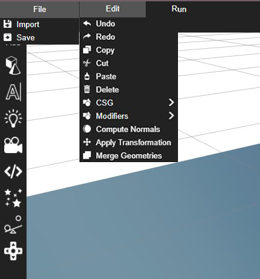
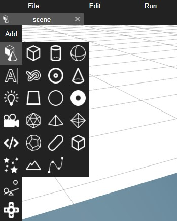
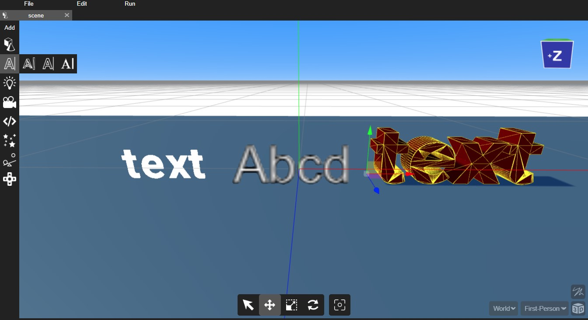
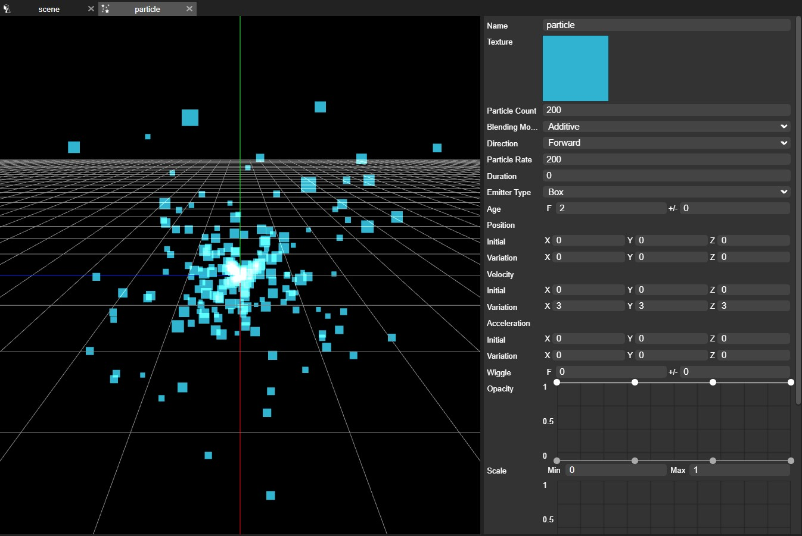

Menu bar provides File Edit and Run options. One can import and save files in File option. Edit option is used to edit 3d object properties such as undo, redo, delete, cut, copy, paste, etc. Run lets you run the game or application.

In the add toolbaqr you can add 3d objects texts lights cameras script particles and controls to the scene.

  

## Adding 3D objects

You can add 3D objects by hovering over the cube and cone icons. Afterward, you can choose from a variety of 3D objects to add, including plane, cube, cylinder, sphere, cone, and more. This intuitive method makes it easy to insert different geometric shapes and objects into your 3D scene.

 

 ## Adding text

There are three types of text options available: Text Mesh, Bitmap Text, and Sprite Text. You can add them by hovering over the text icon, allowing you to choose the most suitable text type for your project. This selection provides flexibility in rendering and displaying text within your scene.

 

 ## Code editor

 By hovering over the code icon, you can add custom scripts to your scene. These scripts can be written in Java and Python, allowing you to add custom functionality and interactivity to your project. This scripting capability provides flexibility for creating dynamic and interactive experiences within your scene

 ## Adding lights

 There are various options available for lights, which you can access by hovering over the lights icon. These options include Point Light, Ambient Light, Spot Light, and more. You can customize their properties, such as intensity, color, resolution, radius, and more, directly in the Inspector panel. This enables you to fine-tune the lighting settings in your scene to achieve the desired visual effects.

 

## Audio

Audio assets are sound files designed for playback through the Sound component. PlayCanvas supports any audio format that is compatible with web browsers, and no processing is applied to the audio file during the import process.

You can also include positional audio in your project, which allows you to create audio that is heard within a specific area or region in your scene

It's important to note that the compatibility of audio formats can vary across different web browsers. Currently, the most widely supported format is MP3 for ensuring reliable audio playback across various browser environments.

## Cameras

You have the option to add two types of cameras for rendering your scene: Perspective and Orthographic cameras. These cameras offer different ways to view and capture your scene. By default, you get a perspective camera view. You can also view and adjust their properties in the Inspector panel, allowing you to tailor the camera settings to your specific rendering needs and scene composition.

## Font

A Font asset comprises an image encompassing all the characters of the chosen font and associated data specifying how each character should be rendered. Font assets are employed to display text using an Element component of the Text type. To render text, add an Element component to an Entity, set its type to Text, and then assign the Font asset by dragging and dropping it into the Font slot of the Element component.

Creating a Font asset involves uploading a font file with extensions like .ttf, .ttc, .otf, or .dfont. Upon upload, the font undergoes conversion into a multi-channel signed distance field format. This transformation preserves font details at various sizes, allowing you to utilize the same font for different display sizes. However, the effectiveness of this technique may vary depending on the specific font being used.

## Particle Emitter

A Particle Emitter is a system that generates and manages particles in a scene. A Particle Emitter Asset serves as a reference to the settings and properties of this particle system, including the appearance and behavior of the particles. This allows you to create a wide range of particle effects, from simple sparks to complex simulations like fire, smoke, and explosions, all within your scene.

Furthermore, the Particle Emitter comes with its own editor, where you can easily adjust properties of particles, such as texture, position, scaling, rotation, and more, providing precise control over the look and behavior of your particle effects.

