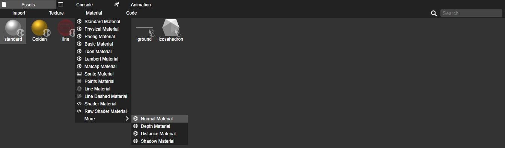
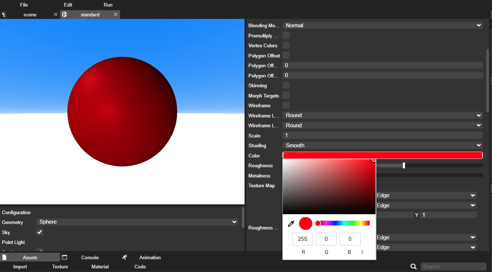
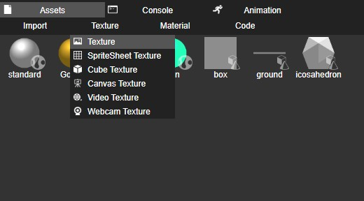
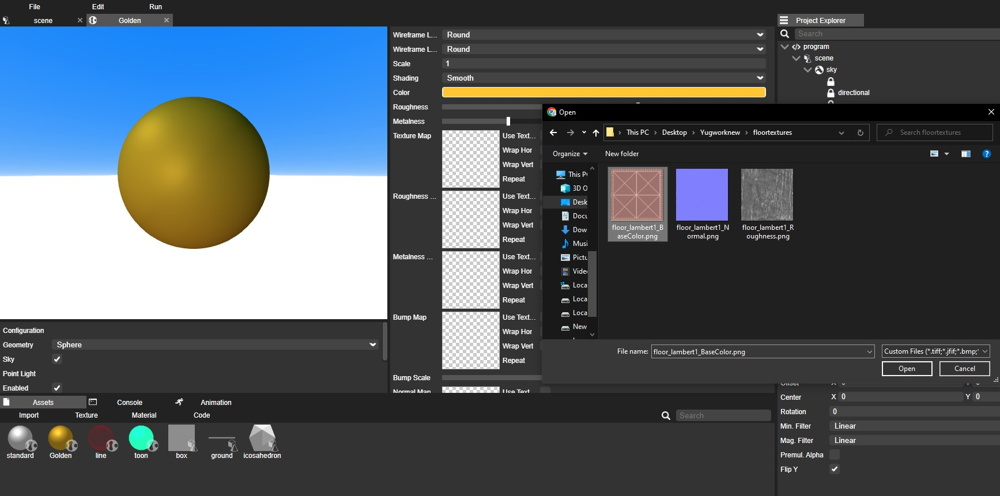

## Materials

In the Yug Forge web editor, "materials" refer to the visual attributes applied to 3D objects to determine their appearance, including color, texture, reflectivity, and transparency. Materials enable users to define how light interacts with objects in a 3D scene, making objects look realistic or stylized. Users can apply materials to surfaces, adjusting properties like roughness, metallicness, and opacity, allowing for diverse and visually appealing 3D designs. Materials play a crucial role in defining the overall look and feel of objects within a 3D environment in the Yug Forge web-based modeling and design tool.

## Types of Materials

Yug Forge offers various material types, each suitable for different purposes:

1. Standard Material
Standard materials are versatile and suitable for various scenarios. They offer control over essential properties such as color, shininess, and transparency. These materials are ideal for creating a wide range of 3D objects with diverse visual characteristics.

2. Phong Material
Phong materials provide enhanced control over the specular highlights of an object's surface. They allow for the adjustment of parameters like specular color, specular intensity, and shininess, making them suitable for objects that require precise control over reflections and highlights.

3. Toon Material
Toon materials are known for their characteristic flat shading and cartoon-like appearance. They create a stylized, non-photorealistic look by simplifying lighting and shading, making them perfect for achieving a more artistic or animated aesthetic.

4. Lambert Material
Lambert materials are diffuse-only materials that don't exhibit specular highlights. They are useful for objects that require a matte or non-reflective appearance, such as clay models or certain types of 2D art style objects.

5. MatCap Material
MatCap materials use MatCap (Material Capture) images to simulate complex surface details and lighting effects. They are excellent for adding intricate surface patterns and visual details to objects, making them appear more complex than they are in terms of geometry.

6. Line Material (Wireframe Material)
Line materials or wireframe materials are used to represent the wireframe structure of 3D objects. They display the edges and contours of objects, which can be helpful for showcasing an object's geometry or for creating a stylized, technical, or blueprint-like appearance

### Adding materials

Within the Yug Forge web editor, you have the opportunity to select from a diverse array of material options. Each material offers distinct effects when applied to 3D objects, influencing their appearance and behavior in unique ways. These materials can alter an object's color, texture, reflectivity, transparency, and more, allowing for creative control over the visual characteristics of 3D elements in your design. This broad selection of materials empowers users to craft and customize their objects with precision, achieving desired aesthetics and effects within the web-based modeling environment.

In Yug Forge web editor, you can add materials by clicking the "Materials" option in the Assets Panel and selecting the desired material. This action adds the chosen material as a new asset in the panel, offering a straightforward way to expand material choices and enhance 3D object appearances.

### Editing material properties

In Yug Forge, material editing is done within the Material Editor. You can access this editor by double-clicking on a material, which opens a separate window alongside the main scene view. Inside the Material Editor, you have the flexibility to modify various properties of the material, including its name, color, roughness, metalness, opacity, and texture maps. This powerful tool allows for precise customization of material attributes to achieve the desired visual effects in your 3D designs.

### Applying materials

This process is straightforward: begin by selecting the specific object you wish to enhance. Next, navigate to the Assets Panel, where you'll find the "Materials" section. Here, you can browse and select a suitable material for your object. To apply the chosen material, it's as simple as dragging and dropping it directly onto the object or onto the object's name in the project explorer. This quick and intuitive method allows you to elevate your 3D objects' visual quality and overall aesthetics with ease.

### Cloning and Deleting Materials

Easily clone existing materials or delete ones you no longer need within the Material Editor.

### Material Hierarchies

Create complex material hierarchies by assigning materials to different parts of an object, allowing for intricate and detailed textures.

## Textures

"Textures" refer to 2D images or patterns applied to the surface of 3D objects. These textures enhance the visual appearance by adding details like color, patterns, and surface characteristics. Texture mapping wraps 2D images around 3D objects, creating realistic materials, artistic designs, and lifelike scenes within the Yug Forge 3D modeling environment.

### Diffuse (Albedo) Textures

Enhance material realism by adding diffuse textures to simulate surface colors and patterns.

### Normal Maps

Add normal maps for intricate surface details and bump mapping, creating the illusion of depth on objects.

### Specular and Gloss Maps

Fine-tune the reflectivity of your materials using specular and gloss maps, achieving realistic surface reflections.

### Emissive Maps
To create objects that emit light or glow, apply emissive maps to materials.

By mastering these material and texture features in Yug Forge, you can craft immersive, visually stunning 3D scenes and objects tailored to your creative vision. Experiment with various material types, textures, and properties to achieve your desired aesthetic and realism in your 3D projects.

### Adding textures

In Yug Forge, you have the flexibility to create various types of textures, whether they are standard image textures or dynamic video textures. To add a texture, follow these simple steps: 

1. Hover over the "Textures" option within the Assets Panel.
2. Select from the list of available textures.
3. A pop-up window will appear, enabling you to choose an image or video to apply as a texture to your 3D object or scene. This straightforward process allows you to enhance the visual richness of your 3D projects with a diverse range of textures, enhancing their realism and appeal.

### Adding textures to a material

In Yug Forge, applying textures to a material is a straightforward process within the Material Editor:

1. Open the Material Editor.

2. To add textures, you have two options:
   - Drag and drop textures directly from the Assets Panel onto the respective checkered box within the Material Editor.
   - Alternatively, click on the checkered box and choose an image or video texture from your assets.

This user-friendly approach allows for easy customization of materials with textures, enhancing the visual richness and realism of your 3D objects and scenes.

