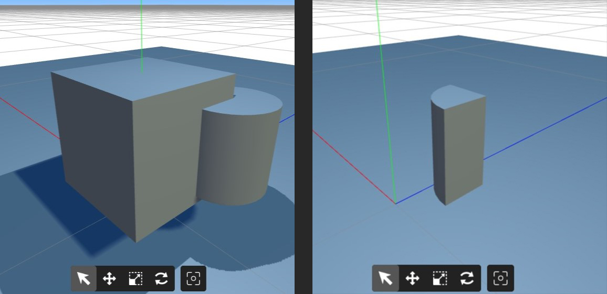
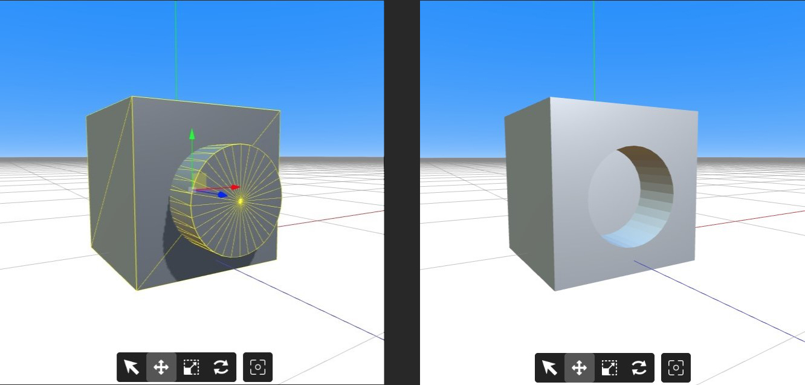
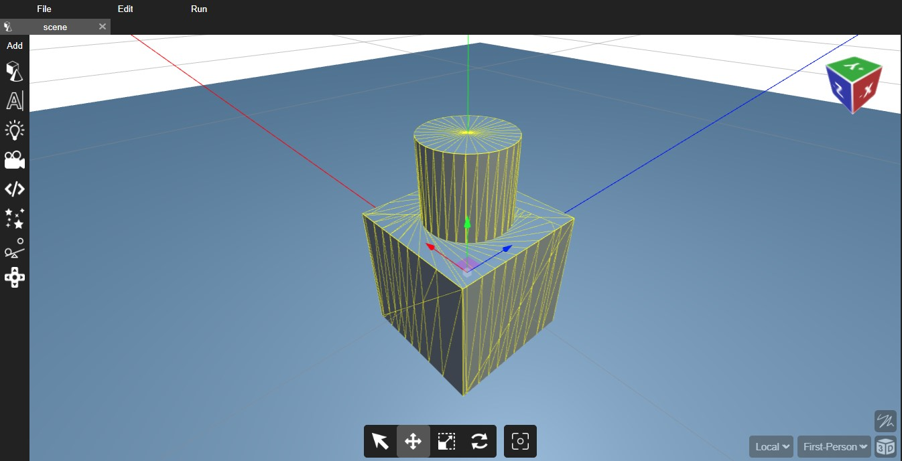
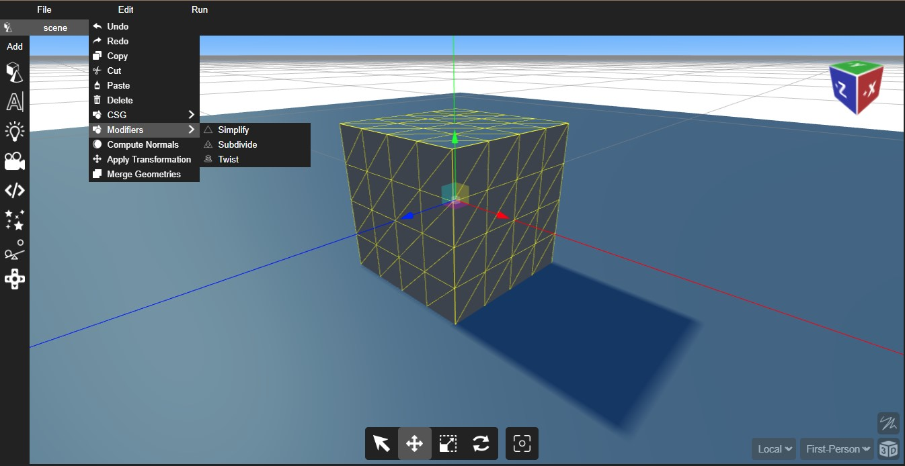
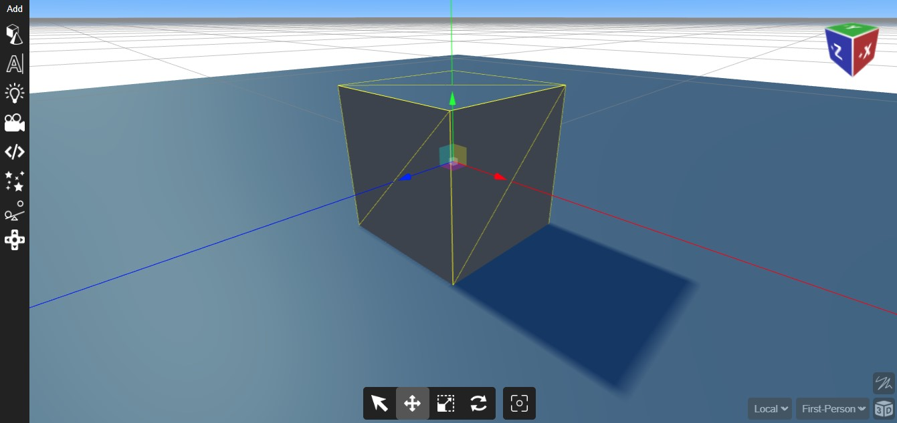
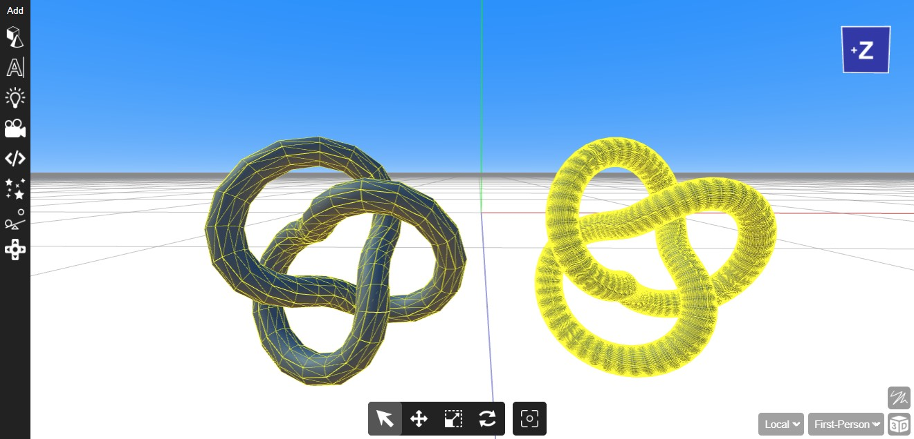

## CSG

Yug Forge offers Constructive Solid Geometry (CSG), a 3D modeling technique that combines basic geometric shapes using set operations like union, subtraction, and intersection. Primitives are manipulated to create complex objects, making it useful for precise modeling and 3D design but can be computationally intensive for complex models.

### Intersect

CSG Intersect is a 3D modeling operation that creates a new object by preserving only the overlapping regions of two input objects. For example, applying CSG Intersect to a sphere and a cube yields an object representing their shared area while discarding non-overlapping sections. It's valuable in precise modeling and collision detection.

In a 3D scenario featuring a cylinder and a cube, you can create a new object representing their shared region by selecting both objects, then accessing the "Edit" menu, choosing "CSG," and finally selecting "Intersect." This process isolates the overlapping area while excluding non-overlapping parts of the objects.

### Subtract

CSG Subtract is a feature in 3D modeling that allows you to remove the shape of one object from another. Essentially, it subtracts the last-selected object from the first-selected object.

To illustrate this, let's consider an example: Suppose you want to create a hole in a cube. First, select the cube, and then select the cylinder. While both objects are selected, navigate to the "subtract" option found in the "Edit" menu under CSG. This action will result in the cylinder being subtracted from the cube, effectively cutting a hole in the cube. You can visualize the outcome in a manner similar to what's depicted in image 2.

### Union

CSG Union is a 3D modeling operation that combines two or more objects to create a single object that encompasses all of them. In this operation, objects are merged together, and their shared volume forms the final result. It's often used to create more complex shapes by joining simpler ones, making it a valuable tool in computer graphics, CAD, and 3D design.

Unlike grouping or basic combination, CSG Union in 3D modeling combines not just objects but also their topologies, effectively merging their volumes into a single, cohesive object. To perform a union operation on two 3D objects, select the objects you wish to merge and then navigate to the "Edit" menu, followed by "CSG," and choose "Union." This process integrates the selected objects, preserving their individual topological properties while creating a unified object.

## Modifiers

Modifiers are used to alter the geometry of objects. They can be applied to change various aspects of an object, including its polygon count, shape, texture, and more. These modifications can help achieve desired effects, optimize performance, or enhance the visual appearance of 3D models.

### Simplify

The "simplify" modifier is employed to reduce the polygon count or simplify the geometry of an object. It's often used to decrease the number of segments or polygons in a model, making it more suitable for rendering on low-end devices or optimizing performance.

To use the "simplify" modifier, select the desired 3D model, then access the "Edit" menu and choose "Modifiers." From the list of modifiers, select "Simplify."

 

### Subdivide

Unlike the "simplify" modifier, "subdivide" is its opposite. The "subdivide" modifier increases the number of segments or polygons in an object. By specifying a numerical value, you can multiply the existing segments, resulting in a more detailed object with a higher level of complexity. This can enhance the object's smoothness and intricacy.

To use the "subdivide" modifier, first select the desired 3D model. Then, access the "Edit" menu and choose "Modifiers." Within the modifier options, select "Subdivide." This action enables you to increase detail and smoothness in your object by subdividing its existing segments or polygons to enhance its complexity in 3D modeling.

## Merge geometries 

The "merge geometries" operation combines multiple separate objects into a single unified object without altering their individual polygon counts. To perform this operation, select the objects you wish to merge, navigate to the "Edit" menu, and choose "Merge Geometries." This action results in a new object that seamlessly integrates all the selected objects into one.

