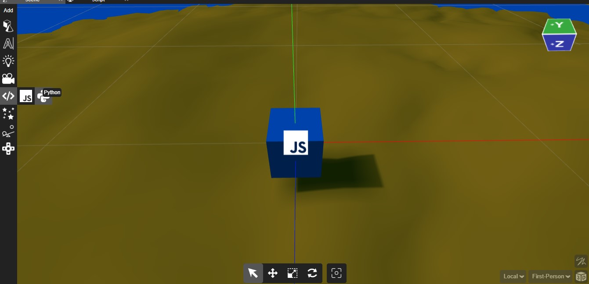
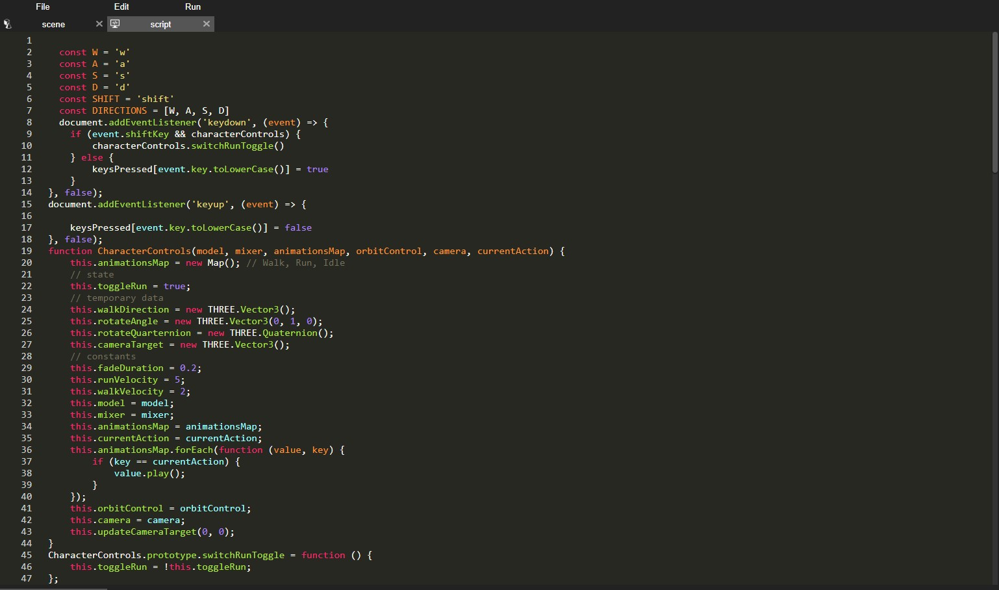

## Introduction

Scripting in Yug Forge adds a powerful layer of interactivity and customization to your projects. In this documentation, we'll explore scripting in two popular languages, Java and Python, within the Yug Forge environment.

## Table of Contents

1. **Getting Started**
   - Enabling Scripting in Yug Forge
   - Accessing the Scripting Console

2. **Java Scripting**
   - Basics of Java Scripting
   - Example: Adding Interactive Elements

3. **Python Scripting**
   - Basics of Python Scripting
   - Example: Manipulating 3D Objects with Python

4. **Best Practices**
   - Ensuring Cross-Browser Compatibility
   - Debugging and Troubleshooting

## 1. Getting Started

### Adding Scripting in Yug Forge

To enable scripting in yug fotge you first need to add script of your choice by clicking on the script icon in the add menu then add thr script of your choice as of now you get java and python.




### Accessing the Scripting Console

Access the scripting console within Yug Forge, where you can write, test, and execute your scripts. This console provides real-time feedback and error reporting.




## 2. Java Scripting

### Basics of Java Scripting

Java is a versatile language for Yug Forge scripting. Key points include:
- Declaring variables
- Writing functions
- Event handling for user interactions
- DOM manipulation for updating the document structure

### Example: Adding Interactive Elements

```java
// Java Script Example
function addButton() {
    var button = document.createElement("button");
    button.innerHTML = "Click me";
    button.onclick = function() {
        alert("Button clicked!");
    };
    document.body.appendChild(button);
}
```

## 3. Python Scripting

### Basics of Python Scripting

Python is known for its readability and simplicity in Yug Forge scripting. Key points include:
- Declaring variables
- Defining functions
- Working with libraries for enhanced functionality
- Event-driven programming for web interactions

### Example: Manipulating 3D Objects with Python

```python
# Python Script Example
def rotate_object(object_id, angle):
    # Code to rotate a 3D object
    pass

# Example usage
rotate_object("cube1", 45)
```

## 4. Best Practices

### Ensuring Cross-Browser Compatibility

Write scripts in Yug Forge that are compatible with major web browsers to ensure a consistent user experience.

### Debugging and Troubleshooting

Use Yug Forge developer tools to debug scripts. Utilize console logs and error messages for efficient troubleshooting.

By incorporating scripting into your Yug Forge projects using Java and Python, you can create dynamic, interactive, and customized experiences. Experiment, iterate, and push the boundaries of what your Yug Forge projects can achieve with the power of scripting.