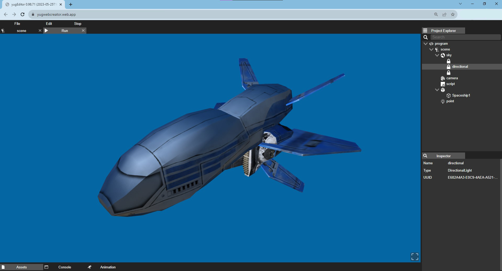
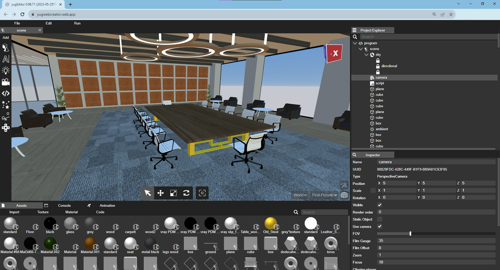
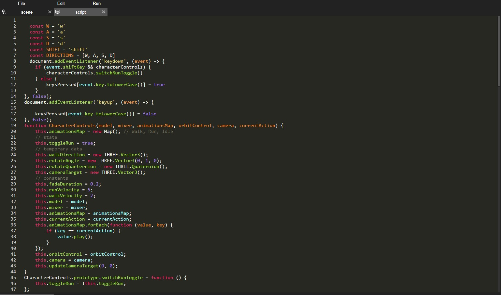

# Introduction to YUG forge

## What is YUG forge?

YUG forge is a in-browser WebGL editor is a powerful tool for creating and editing 3D graphics in real-time. It's accessible, intuitive, and offers a wide range of features, including shaders, animation, and seamless integration with web technologies. Whether you're a beginner or an experienced artist, this editor provides a user-friendly solution for 3D content creation.

## Upload and create assets

YUG forge supports a wide variety of industry standard asset formats. For example, upload images, 3D models, audio files or custom text or binary file formats.

## Create your scene

The YUG forge Editor is a visual building tool which is used to construct scenes. Build a hierarchy of entities using built in components like 3D models, collision, particle effects and more.

## Enhance user engagement

Unlock the power of web-standard JavaScript to infuse your entities with bespoke behaviors, opening up a world of interactivity possibilities – from crafting elegant click handlers and mesmerizing orbit cameras to orchestrating epic massively multiplayer online gaming experiences

## Release your application

The YUG forge Editor is a user-friendly editing platform that empowers you to swiftly create scenes, applications, and games. Leverage the Editor to oversee your project's resources, incorporate interactive elements, and facilitate seamless collaboration with your team. Thanks to real-time collaboration features, you can instantly observe any modifications made by your team members, and you can promptly develop and evaluate your application on various devices.

The headers are well-spaced so that the hierarchy is clear.

- lists will help you
- present the key points
* that you want your users to remember
  3.1. and you may nest them
    - multiple times