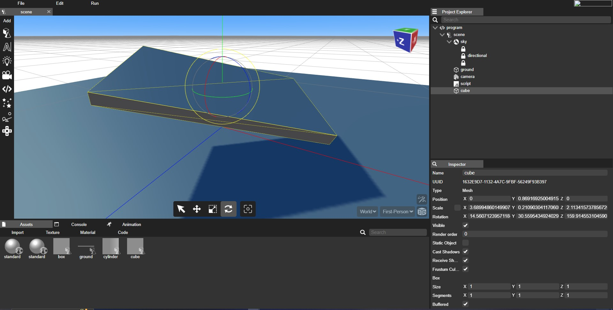
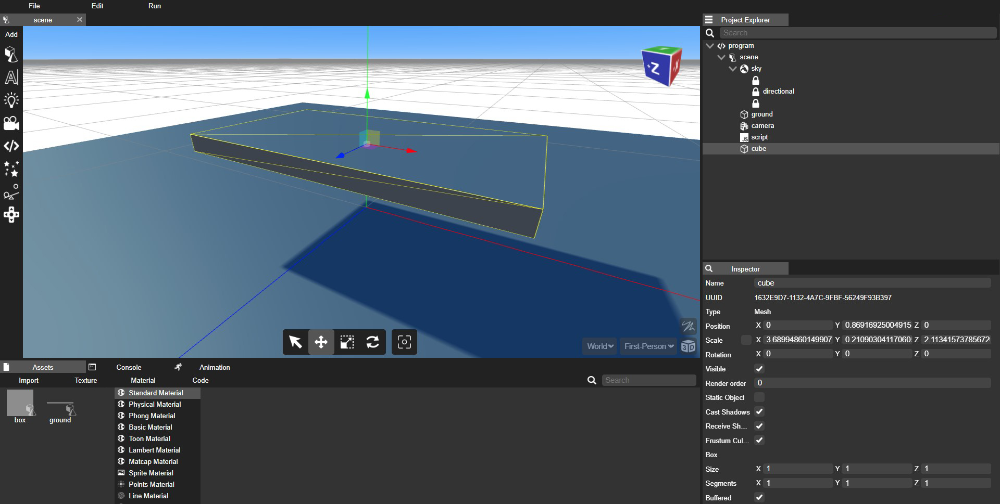
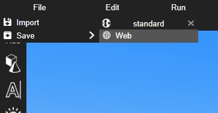

## Introduction

In this tutorial, we'll explore the basics of using a web-based 3D editor to create and manipulate 3D models. Web-based 3D editors offer a convenient way to design, visualize, and export 3D objects for various purposes, including games, simulations, and 3D printing.

## Prerequisites

Before we begin, ensure you have the following:

- A modern web browser (Google Chrome, Mozilla Firefox, or similar)

- An internet connection

- Basic familiarity with 3D concepts (optional but helpful)

## Step 1: Accessing the Web 3D Editor

1. Open your web browser and navigate to the website or platform hosting the web-based 3D editor.

2. Sign up for an account or log in if required.

3. To access the editor, click on "Profile," then select "My Projects." Inside "My Projects," click on "Create New."

4. Enter the name and description of the project and save it.

## Step 2: Navigating the Interface

- Scene: The central area where you view and manipulate 3D models.

- Navigation Toolbar: The area where you can select move scale rotate and focus on an object.

- Add Toolbar: Contains tools for creating, modifying, and interacting with 3D objects.

- Project Explorer: Lists all objects in the scene, making it easy to select and organize them.

- Inspector: Displays details and settings for the selected object.

- Assets Viewer: Lets you import assets, textures, font ,audio and Create New materials, texture, Java Script and HTML 

## Step 3: Creating a 3D Object

Let's create a simple 3D object to get started.

1. Click on the "Create" or "Add Object" button in the toolbar.

2. Choose a basic shape (e.g., cube, sphere) from the available options.

3. Click on the shape to place the object in the scene.

## Step 4: Modifying and Transforming

Now, let's modify and transform the object.

1. Select the object in the project explorer or by clicking on it in the scene.

2. Use the Navigation Toolbar tools to scale, rotate, or move the object.

3. Experiment with different transformations to understand how they affect the object.

## Step 5: Applying Materials

Adding materials and textures can make your 3D object more visually appealing

1. Select the object.

2. Navigate to the Assets Panel and find the "Materials" section.

3. click on any material from the material section suitable for the object.

4. Drag and drop the new material onto the object or the name of object in project explorer.

## Step 6: Editing Materials and Applying textures

Material editor lets you edit material properties such as color, bump mapping, highlight and reflection information and apply various textures

1. Double-click on the material you wish to edit. after clicking on the material a material editor will open up

2. In the material editor you can change color, roughness, metal-ness and add bump, emissive, ambient occlusion to the material

3. One can also apply custom textures by clicking on texture, roughness and metalness map option.

## Step 7: Saving the file

1. Navigate to the File panel, inside file panel click on save then web.

2. Your file will be saved on the web.

## Conclusion

Congratulations! You've completed the basic tutorial for using a web-based 3D editor. This is just the beginning, as 3D editing can be a complex and creative process. Explore advanced features and experiment with different objects and materials to enhance your 3D design skills.
