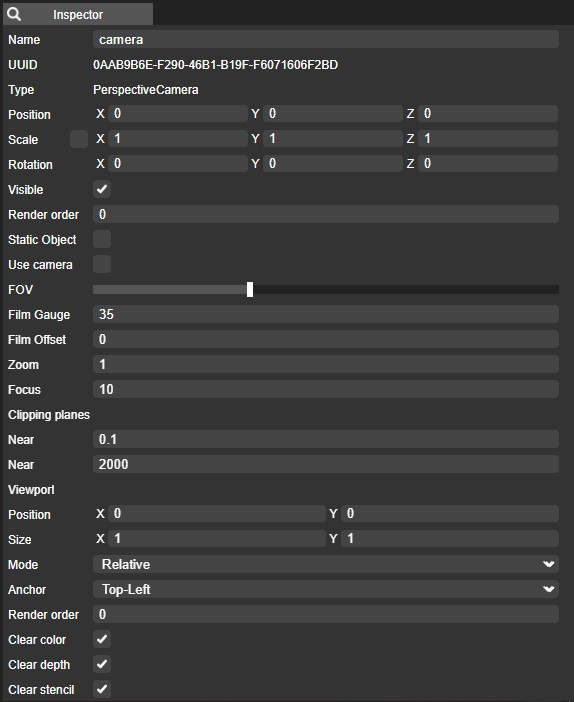

# Cameras

## Introduction

Cameras in Yug Forge play a pivotal role in controlling the viewpoint and rendering of 3D scenes. This documentation provides an overview of camera functionality within Yug Forge, including the two primary types: Perspective and Orthographic cameras.

## Table of Contents

1. **Types of Cameras**
   - Perspective Camera
   - Orthographic Camera

2. **Camera Controls**
   - Navigating the Viewport
   - Adjusting Camera Settings
   - Changing Camera Types

## 1. Types of Cameras

### Perspective Camera

**Perspective cameras** simulate the way the human eye perceives depth in the real world. They create a natural sense of depth and perspective, making objects appear smaller as they recede into the distance. Perspective cameras are ideal for creating realistic and immersive 3D scenes, as they closely resemble how we perceive the world around us.

### Orthographic Camera

**Orthographic cameras**, in contrast, render objects without perspective. All objects appear the same size regardless of their distance from the camera. This camera type is useful for technical drawings, architectural plans, and 2D game development, where maintaining consistent object proportions is crucial.

## 2. Camera Controls

### Navigating the Viewport

- **Orbit:** Rotate the camera around a fixed point in the scene.
- **Pan:** Move the camera laterally within the scene.
- **Zoom:** Adjust the camera's field of view to zoom in or out on objects.
- **Fly/Walk:** Navigate the camera as if you're moving through the 3D environment.

### Adjusting Camera Settings

Camera settings can be adjusted in the inspector one can do that just by selecting it.  

- **Focal Length:** Change the perspective camera's focal length to control the degree of distortion and zoom.
- **Field of View:** Adjust the perspective camera's field of view to control the viewing angle.
- **Clipping Planes:** Set the near and far clipping planes to control what is visible within the camera's view.

### Changing Camera Types

You can switch between perspective and orthographic cameras in Yug Forge to suit your project's requirements. Each camera type offers unique advantages for different types of 3D scenes.

By mastering camera types and controls in Yug Forge, you can effectively frame and capture 3D scenes to achieve your desired visual effects and storytelling goals. Whether you're creating immersive worlds with perspective cameras or precise technical drawings with orthographic cameras, understanding camera functionality is key to your success in 3D design and visualization.