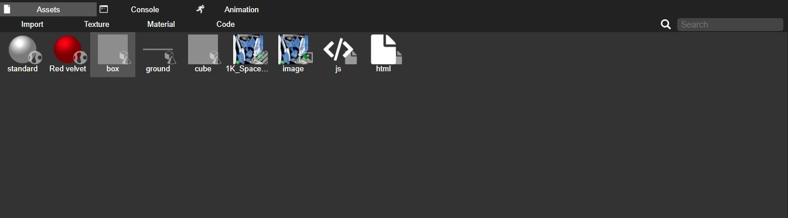
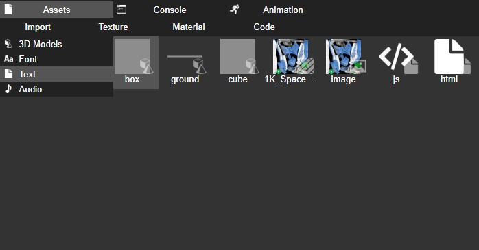
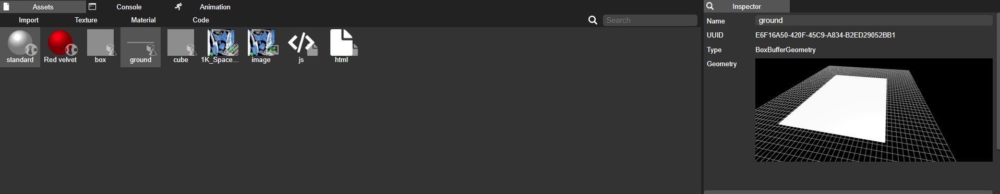
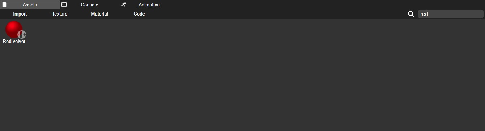
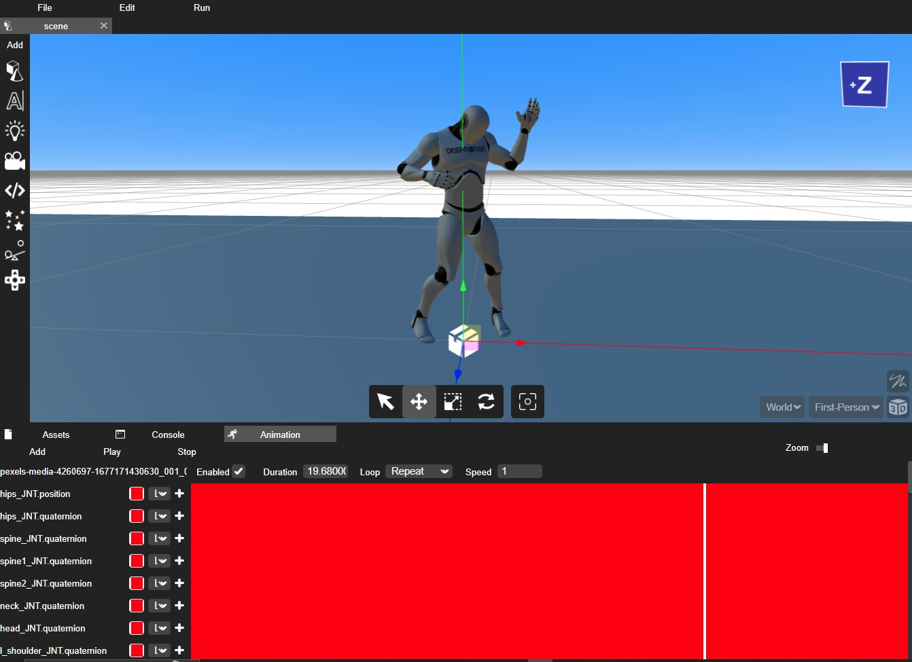

The Assets Panel serves as the control center for managing all assets within your project. Within this panel, you have the capability to create, upload, delete, inspect, and edit any asset as needed.

The Assets Panel is comprised of three main components: Assets, Console, and Animation. These components collectively provide tools and functionality for managing assets, monitoring console output, and working with animations in your project.

Within the Assets Panel, you can add a wide range of elements to your project, including 3D models, fonts, textures, audio files, various types of materials, JavaScript code, and HTML content. This versatile panel allows you to import and manage diverse assets and resources to enhance your project's functionality and visual appeal.

## Importing Assets

You have the capability to import a variety of assets into your project, including 3D models, fonts, text elements, and personalized audio files. This flexibility enables you to enrich your project with a wide range of content and resources tailored to your specific needs.

## Inspecting Assets

To examine the specifics of any particular asset, simply click on its thumbnail within the Assets Panel. The asset's details will then be presented in the Inspector panel, allowing you to view and modify its attributes and settings as needed.

## Locating an Asset

To search for assets in your project, utilize the Search box. As you begin typing in this box, the Editor will dynamically display matching results in the Assets Panel, making it easy to find what you're looking for.

## Drag and Drop

You can also drag model, material, and other assets directly into the Viewport.

If you drag a model asset into the Viewport, a new object will be created with a model component using the model asset. If you drag a material over a particular mesh instance in the Viewport, its material will be switched.

## Animation

An Animation asset is employed to execute a single animation on a 3D model. These animations are brought into the system by uploading 3D scenes, often in the form of FBX files, which carry animation data. The asset pipeline then extracts this animation data from the uploaded file and generates a Target Asset for in-game use.

