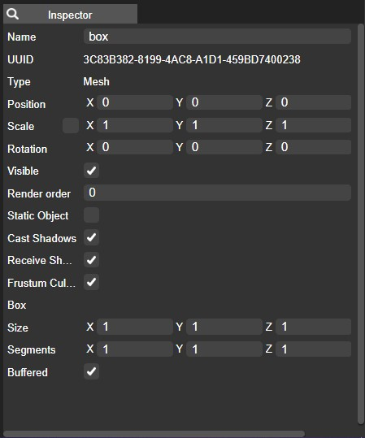

The Inspector panel displays the attribute values associated with the presently selected item.

Adjusting these values is how you define the behavior of your entity. For instance, you can designate the model to be rendered for a Model Component or specify the color of a light.

Certain attributes consist of straightforward text or numeric values, and, in such cases, standard text fields or slider controls are employed. However, some values might demand more specialized input methods. For instance, when selecting an Asset, the available assets in the asset panel will be highlighted for you to choose from. Additionally, certain values can be manipulated directly through the viewport; for example, the Translate, Rotate, and Scale values can be edited by moving and dragging the corresponding Gizmo within the viewport.

