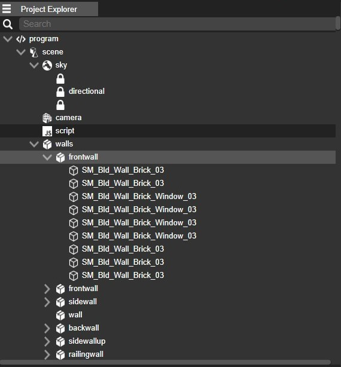
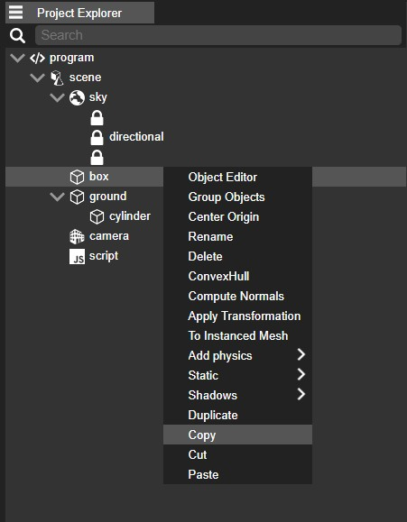

the "Project Explorer" is a panel or interface element that serves as an organizational tool for managing and navigating the various elements and assets within a project.The Hierarchy panel shows you a tree view of your entire Scene which is made up from a hierarchy of objects.

The project explorer is great for quickly finding objects as all the objects in your Scene will be visible all the time. Clicking on an object in the Hierarchy will select it.

## Creating hierarchy

Once an object is selected in the explorer, you can create a new child Entity or delete the Selection. You can do this dragging an object that you want to be child onto the object you want to make parent. you can also remove an object from hierarchy by dragging it out.

## Arranging objects 

The order in which "objects" are listed in the tree view is important. As the scene is a hierarchy, objects can be children of another "object" — their parent — and the transform matrix of a parent "object" is applied to all of its children. If you move or rotate a parent "object," all children will move or rotate underneath the parent. This is very useful for simplifying the manipulation of many "objects."

The structure of the hierarchy can be edited via drag and drop. Simply select and drag any "object" in the hierarchy.

## Searching in the Explorer

At the upper section of the Project explorer, you'll find a Search box that allows you to actively filter the contents of the "object" hierarchy. This search function uses fuzzy matching, which means it identifies names that closely resemble your search term rather than needing an exact match. This can be particularly useful when you're uncertain about the exact name of the "object" you're trying to locate, as it will still locate items with similar names.

## Copying / Pasting objects

If you wish to paste Entities under a new parent you can select them and by right clicking you can copy them to paste them under the selected parent.