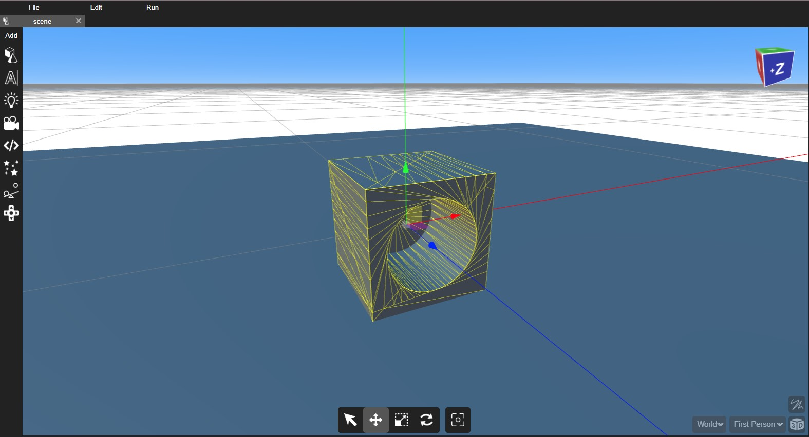
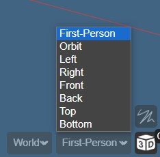
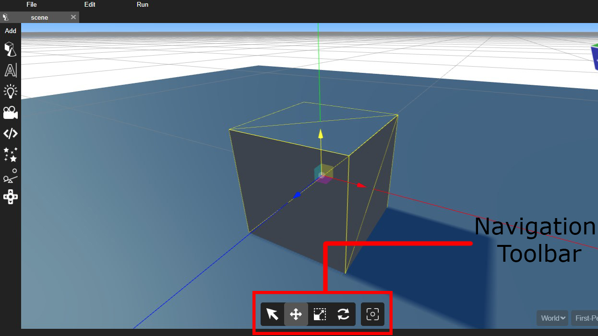
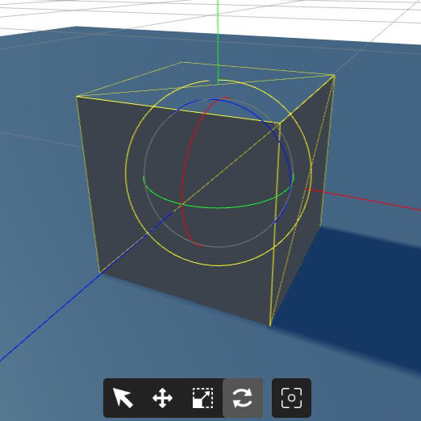
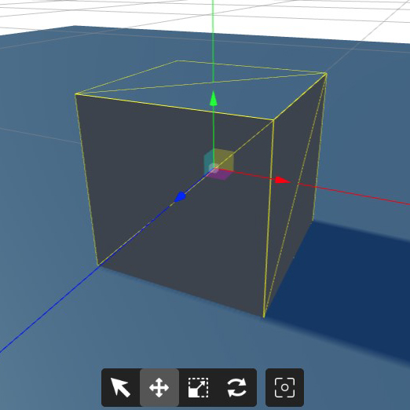
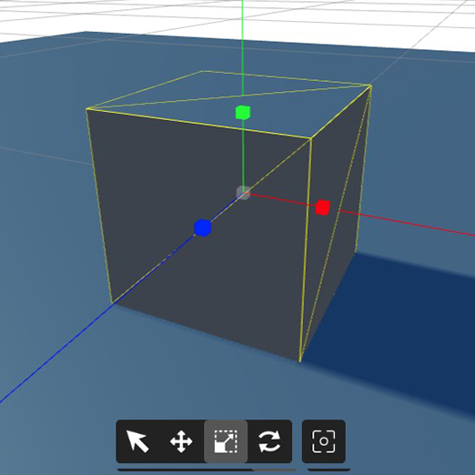

The scene is the viewport shows your scene as currently rendered. You can freely move around the scene by manipulating the Editor's current camera.

## Camera mode and Snap to grid

The Editor initially uses the Perspective camera, offering a floating movie camera perspective. You can switch to other views like Top, Bottom, Front, Back, Left, Right for a perspective-free look. You can also select camera Entities in your scene for precise positioning and toggle between 3D and 2D camera modes. Additionally, there's an option to enable snap to grid located above the 3D/2D toggle button for precise object alignment.

## Navigation Toolbar

A navigation toolbar offers tools for controlling object positioning and orientation. It enables users to easily move, rotate, and scale objects within a digital environment.

## Gizmos

a "gizmo" is a visual tool used to manipulate objects within a 3D scene. It typically includes translate (move), rotate, and scale handles, color-coded for the X, Y, and Z axes. The translate gizmo has arrows, the rotate gizmo has circles, and the scale gizmo has squares. These on-screen widgets simplify precise adjustments to object positions, rotations, and sizes, making it easier to work in 3D environments.

 