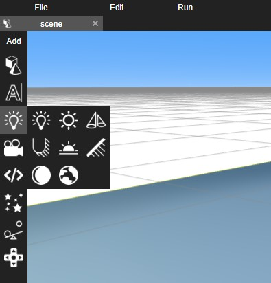
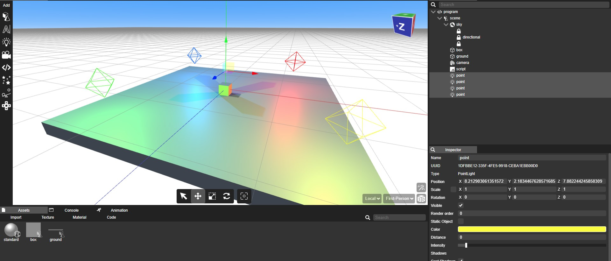
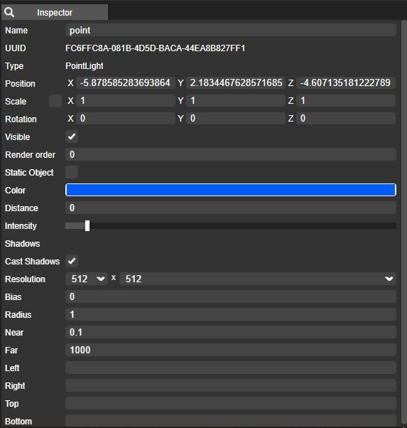

## Introduction

Lighting and environment are essential elements in Yug Forge, playing a pivotal role in creating realistic and visually appealing 3D scenes. This documentation outlines various types of lights, the process of adding lights to your scene, and how to adjust their settings to achieve desired lighting effects.

## Table of Contents

1. **Types of Lights**
    - Ambient Lights
    - Directional Lights
    - Point Lights
    - Spotlights

2. **Adding Lights to the Scene**
    - Placing Lights in the 3D Environment
    - Creating Multiple Lights

3. **Changing Light Settings**
    - Light Intensity
    - Light Color
    - Light Range and Falloff
    - Shadow Settings

## 1. Types of Lights

Yug Forge offers various types of lights to suit different scenarios:

- **Ambient Lights:** These provide uniform, all-encompassing lighting to the entire scene without a specific source. They set the overall mood and brightness.

- **Directional Lights:** These mimic sunlight, emitting parallel rays of light in a specific direction. They are ideal for simulating natural sunlight and casting long shadows.

- **Point Lights:** Point lights emit light in all directions from a specific point in 3D space, simulating sources like light bulbs or candles.

- **Spotlights:** Spotlights emit light in a cone shape and can be focused on specific areas. They are great for highlighting objects or creating dramatic effects.

## 2. Adding Lights to the Scene

### Placing Lights in the 3D Environment

To add lights to your Yug Forge scene:

1. Open your project in Yug Forge.
2. Select the "Light" icon in the add toolbar.
3. Choose the type of light you want to add.
4. Adjust its position and orientation as needed.

### Creating Multiple Lights

You can add multiple lights to a scene to achieve complex lighting scenarios. Simply repeat the above process to introduce additional lights. Yug Forge allows you to blend different types of lights for nuanced lighting effects.

## 3. Changing Light Settings

Once lights are added, you can customize their properties to achieve the desired lighting effects:

### Light Intensity

- Adjust the intensity of the light to control its brightness. Higher values result in brighter illumination, while lower values create subtler lighting.

### Light Color

- Modify the color of the light to influence the scene's mood and ambiance. Experiment with different color temperatures to achieve the desired effect.

### Light Range and Falloff

- Customize the range and falloff of the light to control how far its influence extends and how it attenuates over distance.

### Shadow Settings

- Enable or disable shadows for specific lights. Adjust shadow quality and resolution for realistic shadow rendering.

By understanding these aspects of lighting and environment in Yug Forge, you can create immersive and captivating 3D scenes tailored to your specific design needs. Experiment with different light types, positions, and settings to achieve the desired visual impact in your projects.