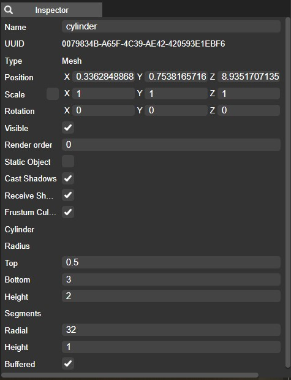
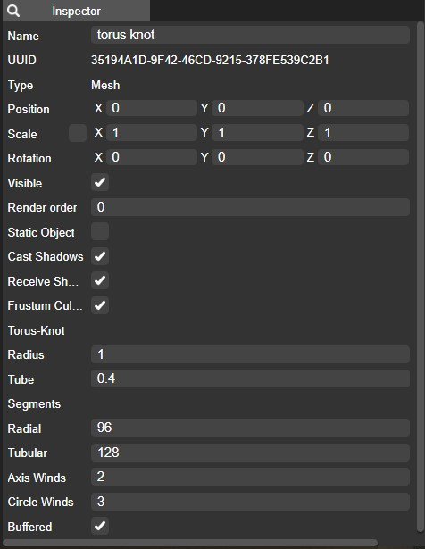
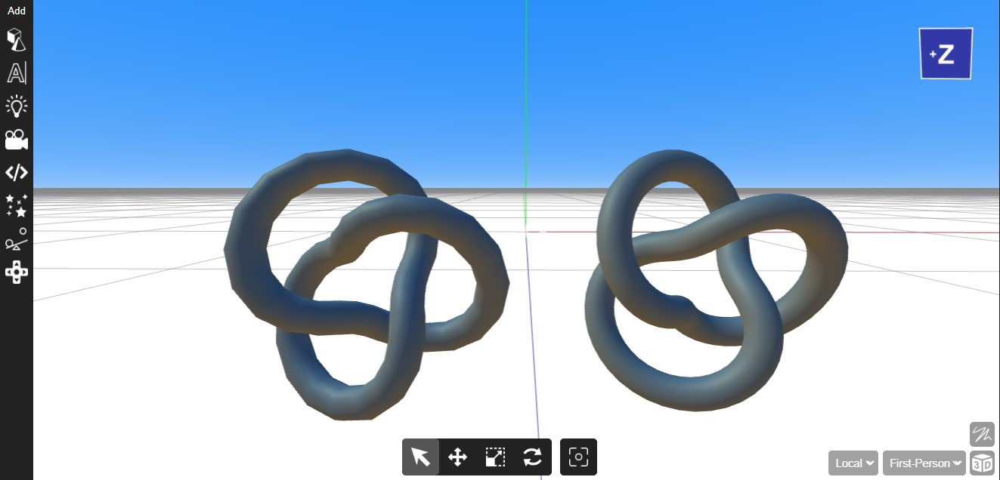
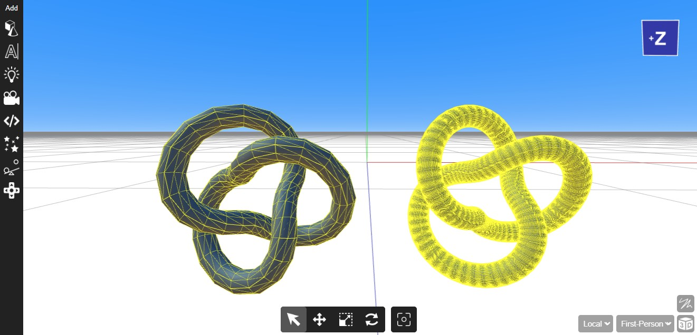
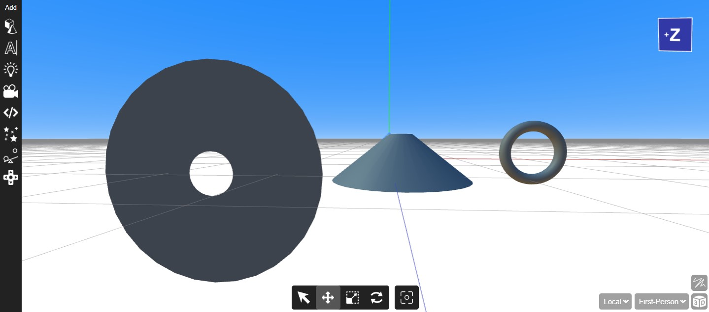

To facilitate the creation of your scene in Yug Forge, a variety of 3D objects are at your disposal, each contributing to the development of a visually captivating environment. Among these objects, you'll find a diverse range of shapes that can be employed to construct your desired setting. This selection includes fundamental shapes like cubes, cones, planes, cylinders, and circles. These objects serve as the building blocks of your scene, allowing you to bring your creative vision to life and craft a beautiful and immersive 3D environment within Yug Forge.

## Adding objects to the scene

You can add 3D objects by hovering over the cube and cone icons. Afterward, you can choose from a variety of 3D objects to add, including plane, cube, cylinder, sphere, cone, and more. This intuitive method makes it easy to insert different geometric shapes and objects into your 3D scene.

## Adjusting of attributes

In the Yug Forge web editor, you have a wealth of options available for modifying the properties of 3D objects, and each object is equipped with its own set of unique properties. To make these adjustments, you can conveniently access the Inspector Panel. This panel provides you with a comprehensive view of the specific properties associated with the selected 3D object. Through the Inspector Panel, you have the flexibility to fine-tune and customize these properties to suit your creative needs, ensuring that your objects are precisely configured to achieve your desired results within the Yug Forge web editor.

 

## Changing the segment settings.

You have a limited set of properties available for customization to suit your scene's needs, and one such property is "segments." These segments can be adjusted, either increased or decreased, based on the level of detail you intend for your scene. Increasing segments can enhance an object's detail, but it should be done judiciously. Using excessive segments can result in a heavier scene that may strain system resources during rendering. Therefore, it's advisable to exercise caution and moderation when making use of this feature.

For instance, in the image below, we have two torus knots. The yellow lines represent the number of segments. The left one has 50 tubular and 10 radial segments, while the right one has 128 tubular and 98 radial segments. The difference is evident in the level of detail, with the right one appearing smoother due to more segments.

## Radius

The radius is the distance from the center of a circle, sphere, or curved object to its outer edge. It defines the object's size and plays a crucial role in determining dimensions, making it a fundamental parameter in mathematics, physics, engineering, and 3D modeling.

In some 3D modeling software, certain objects offer the option to modify their radius. This feature is typically applicable to shapes with a circular or spherical form. By adjusting the radius, you can effectively change the thickness of the object.

For example, consider a simple cylinder. In the provided image, we added a cylinder and altered its top radius to 0.5 units while setting the bottom radius to 3 units. This adjustment results in a shape that tapers from a wider base to a narrower top, effectively changing its thickness.

The same principle applies to other objects like toruses and rings. You can increase or decrease their radius values to adjust their thickness, allowing you to achieve the desired geometry for your 3D model. This radius manipulation is a valuable tool for creating objects with varying thicknesses and shapes in your 3D scenes.

